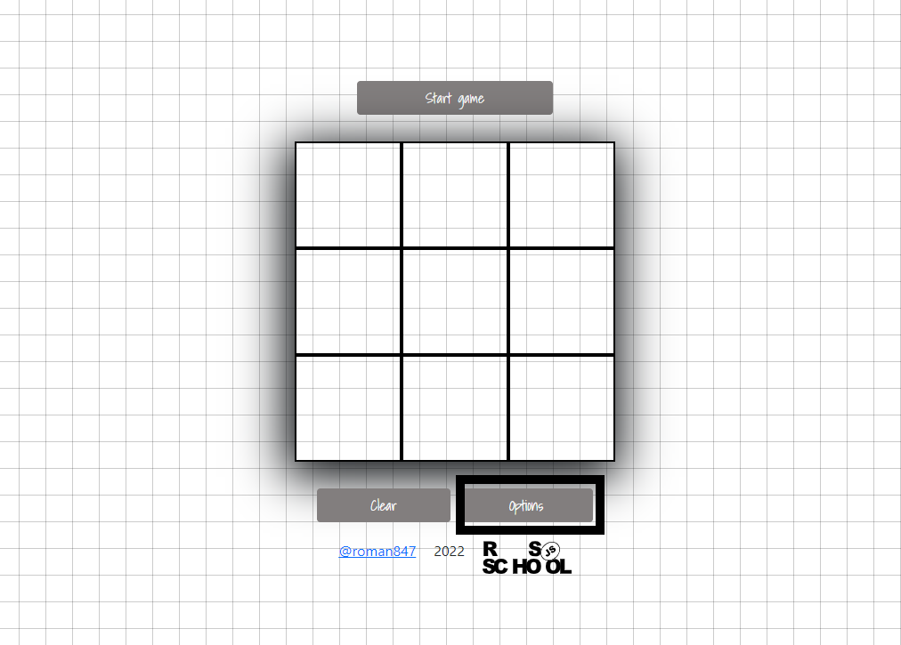
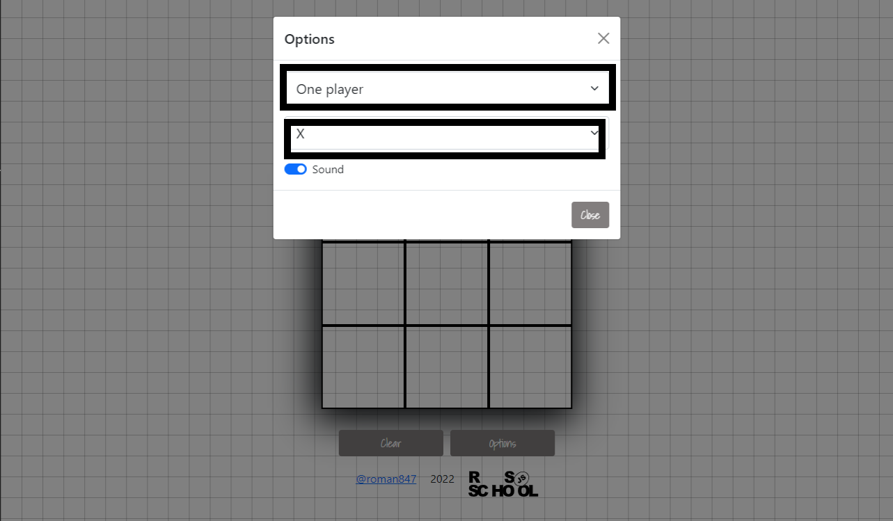

# Tic-tac-toe

## https://roman847.github.io/Tic-tac-toe/index.html

---

### Description

A famous game from childhood help you remember your school-days

#### The rules:

- You must line up your figure (across, height or diagonal)
- Cross goes the first
- If there is not winner - it is draw. You should play again

#### Using the app:

##### Scenario.

- There are 3 scenarios:
  - Two players
  - One player (play with cross)
  - One player (play with zero)

Default scenario is One player (play with cross). If you want to change scenario  
you should click **"Options"** and change the number of player and your figure .

#### Play game

- If you want to start game you should click on **"Start game"**.
- If tou want to clean games window you should click on **"Clear"**

---

### What has been used in the project:

- _Html/Css_
- _Sass/Scss_
- _JavaScript (native)_
- _Bootstrap_
- _Animate.css_ (animation-library)
- _Webpack (Full project is built with Webpack)_
- _Node.js v. 16.13.2_
